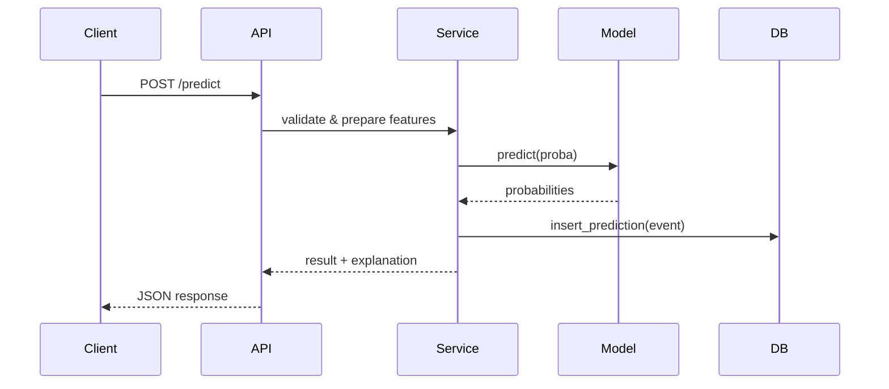

<!--
Comprehensive system documentation for the churn prediction platform.
Generated by assistant based on repository analysis.
-->
## Table of Contents
1. Introduction
2. System Overview
3. Installation
4. Configuration
5. Usage
6. API Reference
7. Data Models
8. Algorithms
9. Performance Metrics
## Table of Contents
1. Introduction
2. System Overview
3. Architecture and Component Diagram
4. Installation & Local Development
5. Configuration & Environment Variables
6. Runtime Behavior & Request Flow
7. API Reference (Endpoints & Schemas)
8. Data Models & Database Schema
9. Machine Learning Artifacts & Algorithms
10. Feature Engineering & Preprocessing
11. Explainability & Model Interpretation
12. Monitoring, Logging & Observability
13. Performance & Scaling
14. Testing Strategy
15. Deployment (Docker / k8s / CI)
16. Security Considerations
17. Troubleshooting & Common Issues
18. Contributing Guide
19. Change Log
20. Contacts & Further Reading

---

## 1. Introduction

Purpose: This document provides a single-source, backend-focused description of the churn prediction platform including architecture, developer workflows, ML model details, observability, deployment and troubleshooting guidance. It is written for backend engineers, MLOps and SREs who will maintain, extend, or operate the system.

Scope: Covers service components under `backend/`, ML artifacts under `ml/`, infra manifests under `infra/`, and integration points used by the frontend and analytics consumers.

Audience: Backend developers, ML engineers, DevOps, and technical stakeholders.

## 2. System Overview

High-level summary:
- FastAPI-based monolithic backend exposing REST and WebSocket endpoints.
- In-process model loading with versioning and metadata tracked via MLflow.
- Persistence in MySQL for operational records (predictions, audit logs, metadata).
- Explainability via SHAP; fallback to model feature importances.
- Monitoring using Prometheus instrumentation and Grafana dashboards.
- Batch processing via ThreadPoolExecutor with in-memory job state and optional queueing.

Key responsibilities:
- Serve real-time predictions with validation and schema enforcement.
- Persist prediction events and metadata for auditability.
- Provide explainability payloads for UI and reports.
- Support asynchronous batch predictions and job monitoring.

## 3. Architecture and Component Diagram

Components:
- API layer: `backend/main.py`, `backend/api/*.py` (routes and API wiring).
- Services: `backend/services/*` (prediction_service, explainability_service, dataset_service, batch_queue_service, ml_monitoring_service).
- Model loader: `backend/models/model_loader.py` — loads artifacts, computes artifact hash, exposes `predict()` and `explain()` capabilities.
- DB layer: `backend/db/db.py` — MySQLConnectionPool wrapper and persistence helpers.
- Utils and middleware: auth middleware (`api_key_middleware`), observability, error handling.

Typical data flow (simplified):
1. Client -> POST /predict with JSON payload
2. API validation (Pydantic schema) -> request context enriched
3. `prediction_service` builds feature frame, applies preprocessing, runs model predict/proba
4. Optionally compute SHAP explanations via `explainability_service`
5. Persist prediction event to DB via `db.insert_prediction`
6. Return response to client, and asynchronously emit metrics/events

Mermaid sequence (developer view):


## 4. Installation & Local Development

Prerequisites:
- Python 3.9+ virtual environment
- MySQL server (local or Docker container)
- Docker (for containerized development)

Install dependencies (venv):
- Create venv: `python -m venv .venv`
- Activate: `source .venv/Scripts/activate` (Windows) or `source .venv/bin/activate` (Unix)
- Install: `pip install -r requirements-dev.txt`

Run locally:
- Ensure `.env` exists and points to a running MySQL instance.
- Initialize DB schema: `scripts/init-database.sh` or run migrations if configured.
- Start service: `python run_system.py` or `uvicorn backend.main:app --reload --port 8000`

Running with Docker Compose (recommended):
- `docker-compose -f infra/docker/local-compose.yml up --build`

## 5. Configuration & Environment Variables

Main configuration is via environment variables loaded by `backend/utils/env_config.py` (or `python-dotenv`). Key variables:
- `MYSQL_HOST`, `MYSQL_PORT`, `MYSQL_USER`, `MYSQL_PASSWORD`, `MYSQL_DB` — DB connection
- `MODEL_ARTIFACT_PATH` — path to model artifact (joblib / pickle)
- `ENABLE_API_KEY` — boolean to toggle API key enforcement
- `API_KEY` — shared key used by `api_key_middleware`
- `MLFLOW_TRACKING_URI` — MLflow server for model metadata
- `PROMETHEUS_METRICS_ENABLED` — toggle metrics
- `BATCH_WORKER_COUNT` — ThreadPoolExecutor size for batch jobs

Configuration notes:
- Prefer secret management for production (Vault, Kubernetes Secrets).
- Keep model artifacts immutable; changes should update artifact hash and `model_version` metadata.

## 6. Runtime Behavior & Request Flow

Prediction flow details:
- Validation: Pydantic schemas (see `backend/schemas/prediction.py`) strictly enforce required fields and types.
- Feature building: `prediction_service` maps business-level inputs (customer_id, account_age, usage features) into model features, handles missing value imputation, defaulting and categorical encoding if needed.
- Preprocessing: If a preprocessor artifact exists, it's applied prior to model inference. If not, features must match model's expected input.
- Inference: Model's `predict_proba()` used for churn probability scoring. Predictions are deterministic given identical artifact and input.
- Calibration: If calibration metadata exists, post-process probabilities (Platt scaling / isotonic) via saved calibrator.

Side-effects & persistence:
- Insert event into `prediction_events` table with payload, score, model_version, request metadata and timestamps.
- Optionally emit audit logs into `audit_logs` table for governance.

Asynchronous batch processing:
- `batch_queue_service` accepts CSV uploads or dataset pointers and spins worker tasks using `ThreadPoolExecutor`.
- Job states (queued, running, succeeded, failed) are stored in-memory and optionally persisted depending on configuration.

## 7. API Reference (Endpoints & Schemas)

Common endpoints (implementations under `backend/api/`):
- `GET /health` — returns service status and dependent services status.
- `POST /predict` — real-time prediction (single record) — accepts `PredictionRequest` schema and returns `PredictionResponse`.
- `POST /batch/predict` — upload CSV or reference dataset for batch predictions; returns job id.
- `GET /batch/{job_id}` — job status and result download link.
- `GET /explain/{prediction_id}` — fetch explanation for a specific prediction event.

Example `PredictionRequest` (JSON):
```
{
	"customer_id": "12345",
	"features": {"tenure": 24, "monthly_charges": 80.5, "num_products": 2}
}
```

Example `PredictionResponse`:
```
{
	"customer_id": "12345",
	"churn_probability": 0.78,
	"model_version": "2023-10-20-abcdef",
	"explanation": { "type": "shap", "values": {"tenure": -0.12, "monthly_charges": 0.45}}
}
```

Refer to `backend/schemas` for Pydantic models and JSON contracts.

## 8. Data Models & Database Schema

Primary tables (conceptual):
- `prediction_events`:
	- `id` (PK), `customer_id`, `input_payload` (JSON), `prediction` (float), `model_version`, `explanation` (JSON), `created_at`
- `audit_logs`:
	- operation records for model changes, retraining events, and admin actions.
- `model_metadata`:
	- stores artifact SHA256, path, created_at, and `model_version` for traceability.

Best practices:
- Store raw input and prediction output for reproducibility.
- Keep model metadata immutable and record the artifact hash on load.

## 9. Machine Learning Artifacts & Algorithms

Supported artifact types:
- Scikit-learn / joblib pickles
- XGBoost, LightGBM native boosters wrapped with scikit-learn API

Model versioning:
- `model_loader` computes SHA256 of artifact to create a `model_version` string. MLflow integration can be used to register and fetch model versions.

Algorithm overview (typical in repo):
- Gradient-boosted trees (XGBoost/LightGBM) — strong baseline for tabular churn data.
- Logistic regression — used for interpretable baselines and calibration checks.

Training and retraining:
- Training scripts are under `ml/` and save artifacts and preprocessing pipelines to `ml/artifacts`.
- Retraining triggers should record dataset snapshot, hyperparameters, evaluation metrics and the saved artifact hash.

## 10. Feature Engineering & Preprocessing

Feature pipeline responsibilities:
- Numeric imputation and outlier handling (clip or Winsorize if required).
- Categorical encoding (one-hot, ordinal, or target encoding as appropriate).
- Scaling (only if model requires it; tree-based models often don't).

Feature governance:
- Maintain canonical feature definitions in `config/training_distribution.json` and service-level feature mapping in `prediction_service`.
- Keep feature engineering deterministic and versioned alongside the model artifact.

Feature drift handling:
- `ml_monitoring_service` computes distributional statistics against canonical dataset snapshots and emits drift alerts when thresholds are passed.

## 11. Explainability & Model Interpretation

Approach:
- SHAP is the primary explanation tool via `explainability_service`. It uses a background reference dataset (population snapshot) to compute SHAP values for local explanations.
- If SHAP fails (missing background, heavy model), the system falls back to feature importances from the model (tree-based gain/weight) or permutation importance.

Design considerations:
- Compute SHAP in a background thread to avoid blocking the request thread.
- Limit explanation output size (top-k features) to keep payloads small.
- Persist explanation JSON with prediction event for auditability.

Security/cost tradeoffs:
- SHAP computation can be expensive; consider rate-limiting Explain endpoint or caching explanations for repeated queries.

## 12. Monitoring, Logging & Observability

Metrics:
- Request latency and success rate per endpoint (Prometheus metrics via `prometheus_fastapi_instrumentator`).
- Prediction distribution histograms (probability buckets), model inference time, batch job durations.

Logging:
- Structured JSON logs include request id, customer id, model_version and key timings. Logging configuration in `backend/utils/logging_config.py`.

Tracing:
- Optional integration points for OpenTelemetry. Consider instrumenting internal service calls and database queries for full trace.

Alerts:
- Drift alerts from `ml_monitoring_service` when feature distributions deviate beyond thresholds.
- Error rate and latency alerts configured in Grafana/Alertmanager.

## 13. Performance & Scaling

Key performance considerations:
- Model inference is CPU-bound; for heavy models, consider running inference in specialized worker pods or using inference servers (TorchServe, Triton) depending on model type.
- Batch jobs use ThreadPoolExecutor; for larger throughput consider using Celery/RQ with persistent queues.

Horizontal scaling:
- Containerize the app and scale replicas via Kubernetes.
- Use a shared cache (Redis) or message broker for job/state coordination if moving from in-memory job state.

Resource sizing:
- Measure average and p95 inference time; set worker pod CPU accordingly. Use autoscaling policies based on CPU or custom metrics (queue length, inference latency).

## 14. Testing Strategy

Test types present and recommended:
- Unit tests: in `backend/tests` — validation of schema, core service functions.
- Integration tests: API contract tests (e2e) that spin up a test DB and run through endpoints.
- Model regression tests: ensure new artifacts produce expected metrics on a held-out test set.
- Load tests: simulate concurrent requests to measure latency and throughput.

Commands:
- Run tests: `pytest -q --maxfail=1`

## 15. Deployment (Docker / k8s / CI)

Docker:
- Dockerfile for backend exists under `backend/Dockerfile`. Build image and push to registry.

Kubernetes:
- k8s manifests in `infra/k8s/` include Deployments, Services, ConfigMaps and Secrets templates.
- Use `kubectl apply -f infra/k8s/` or Helm charts if provided.

CI/CD:
- CI pipelines should build artifact, run tests, push to container registry, and deploy to staging then production via GitOps or CI deploy steps.

Rolling model updates:
- Deploy new model artifact as a new image tag or external model store reference. Keep backward compatibility by supporting multiple `model_version` records.

## 16. Security Considerations

Authentication & Authorization:
- API key middleware is used for simple auth; in production, use OAuth2/JWT or mTLS for stronger security.

Secrets management:
- Do NOT store secrets in git. Use Kubernetes Secrets, Vault, or cloud KMS.

Input validation:
- Rely on Pydantic schema validation and additional checks for size limits and unexpected fields to prevent injection or DoS via payloads.

Data privacy:
- Avoid saving personally identifiable information in logs; mask or hash `customer_id` if necessary for privacy/regulatory compliance.

## 17. Troubleshooting & Common Issues

Common symptom: 500 error on `/predict`
- Check logs for stack trace. Common causes: missing model artifact, incompatible feature input, SHAP memory exhaustion.
- Verify `MODEL_ARTIFACT_PATH` and that `model_loader` successfully computed SHA256.

Common symptom: Slow inference
- Check model size and inference CPU usage. If SHAP is enabled synchronously, compute it asynchronously or use cached explanations.

DB connection issues:
- Verify MySQL credentials and pool settings. Increase pool size or connection timeout according to load.

Batch jobs failing intermittently:
- Check ThreadPool executor limits and memory usage. Consider moving to persistent job queue.

## 18. Contributing Guide

How to contribute:
1. Fork and create a feature branch.
2. Write tests for new functionality.
3. Run linters and formatters as project conventions.
4. Open a PR with a clear description of changes and testing performed.

Coding style:
- Follow existing project patterns: Pydantic models for schemas, services for business logic, DB helpers for persistence.

Code review checklist:
- Backwards compatibility of API contracts.
- Model artifacts versioning and reproducibility.
- Proper logging and metrics for new endpoints.

## 19. Change Log

- See repository `VERSION` and `CHANGELOG.md` (if present) for release-level notes. Record model artifact hashes, training dataset snapshot identifiers and evaluation metrics for each model release.

## 20. Contacts & Further Reading

Maintainers:
- Backend Owner: See repository `README.md` for team contacts.

Further reading:
- SHAP documentation: https://shap.readthedocs.io
- Prometheus instrumentation: https://prometheus.io/docs/
- FastAPI docs: https://fastapi.tiangolo.com/

---

Appendix: quick developer checklist
- `pip install -r requirements-dev.txt`
- Ensure `.env` with DB and model path entries
- `python run_system.py` to run locally
- `pytest` to run tests

End of document.